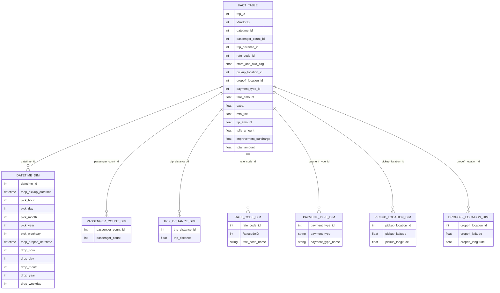

# TripFlow: Uber Data Engineering Pipeline

This project aims to analyze Uber trip data by leveraging Google Cloud Platform (GCP) and modern data engineering tools. The pipeline processes and transforms data to gain insights into taxi trip patterns, fares, and other key metrics using tools like BigQuery, Looker Studio, and Mage Data Pipeline Tool.

---

## 🚀 **Project Overview**

This data engineering project processes and analyzes the TLC Trip Record Data to uncover insights into taxi trip behavior. The pipeline utilizes GCP services for data storage, computation, transformation, and visualization, with modern tools like Mage for data orchestration.

---

## 🏗️ **Architecture**


The architecture includes the following components:
1. **Google Cloud Storage** for raw data storage.
2. **Compute Instances** to perform data transformations using Python scripts.
3. **Mage.ai** as the data pipeline orchestration tool.
4. **BigQuery** for scalable data warehousing and analytics.
5. **Looker Studio** for data visualization and reporting.

---

## 🔧 **Technologies Used**

### Programming Language:
- Python

### Google Cloud Platform Services:
1. **Google Cloud Storage**: Storing raw and processed data.
2. **Compute Instance**: Running Python-based ETL workflows.
3. **BigQuery**: Storing and querying processed data at scale.
4. **Looker Studio**: Creating dashboards for data visualization.

### Data Pipeline Tool:
- [Mage.ai](https://www.mage.ai/): A modern data pipeline tool for orchestrating workflows.

### Open Source Contribution:
- Contribute to Mage.ai: [GitHub Repository](https://github.com/mage-ai/mage-ai)

---

## 📚 **Dataset Description**

The project uses **TLC Trip Record Data** from the NYC Taxi & Limousine Commission. This dataset includes:
- **Trip Information**: Pick-up and drop-off timestamps, locations, distances, and passenger counts.
- **Fares**: Detailed breakdowns of trip costs including tips, tolls, and taxes.
- **Rate & Payment Types**: Information on the applied rate codes and payment methods.

You can access the dataset [here](https://www.nyc.gov/site/tlc/about/tlc-trip-record-data.page).

---

## 🗂️ **Data Model**

The processed data follows a star schema design with a central fact table and supporting dimension tables for efficient querying and analytics.



### Fact Table: `FACT_TABLE`
Contains metrics related to each trip:
- **Key Metrics**: Fare amounts, tips, surcharges, tolls, and totals.
- **Relationships**: Links to dimension tables for detailed analysis.

### Dimension Tables:
1. **`DATETIME_DIM`**: Pick-up and drop-off times and their breakdown into date and time components.
2. **`PASSENGER_COUNT_DIM`**: Number of passengers for each trip.
3. **`TRIP_DISTANCE_DIM`**: Trip distances in miles.
4. **`RATE_CODE_DIM`**: Details about rate codes and their names.
5. **`PAYMENT_TYPE_DIM`**: Types of payment methods (e.g., card or cash).
6. **`PICKUP_LOCATION_DIM`**: Latitude and longitude of pick-up points.
7. **`DROPOFF_LOCATION_DIM`**: Latitude and longitude of drop-off points.

---

## 🔄 **Data Pipeline Workflow**

1. **Ingestion**: Load raw TLC data into Google Cloud Storage.
2. **Transformation**: Use Python and Mage.ai for data cleaning, deduplication, and transformations.
3. **Storage**: Load transformed data into BigQuery.
4. **Analytics**: Use SQL in BigQuery for data analysis.
5. **Visualization**: Create interactive dashboards in Looker Studio.

---

## 📊 **Data Analytics Goals**

- Identify trends in trip volume, fare distribution, and trip durations.
- Analyze pick-up and drop-off location clusters.
- Evaluate payment method popularity.
- Provide insights into tip amounts and trip surcharges.

---

## 🛠️ **Setup Instructions**

### Prerequisites:
- Google Cloud Platform account.
- Python 3.8+ installed locally.
- Mage.ai installed (`pip install mage-ai`).

### Steps:
1. **Clone the Repository**:
   ```bash
   git clone https://github.com/your-repository-url.git
   cd uber-data-analytics-gcp
   ```
2. **Set Up GCP Services**:
   - Enable Google Cloud Storage, BigQuery, and Compute Engine APIs.
   - Create a bucket in GCP Storage for raw data.
3. **Install Dependencies**:
   ```bash
   pip install -r requirements.txt
   ```
4. **Run Mage.ai**:
   ```bash
   mage start
   ```
5. **Load Data into BigQuery**:
   - Use Python scripts to transform data and load it into BigQuery tables.

6. **Build Dashboards**:
   - Connect Looker Studio to BigQuery and design visualizations.

---

## 🤝 **Contributing**

We welcome contributions to improve the pipeline or expand its functionality. Please open an issue or submit a pull request via GitHub.

---

## 📜 **License**

This project is licensed under the MIT License.

---
